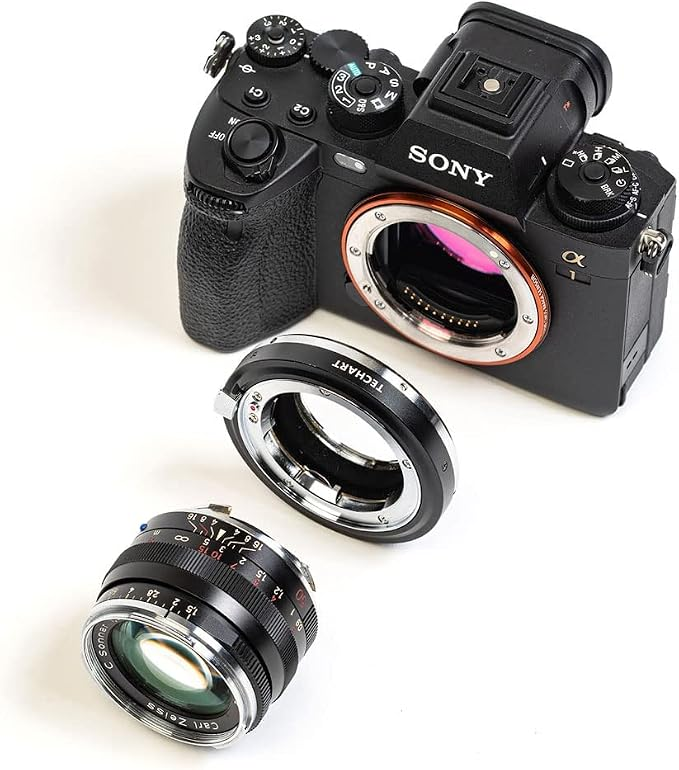

# E-mount AF implementation on the Techart LM-EA9

A working, readable implementation of the Sony E-mount lens protocol — including
autofocus — running on real hardware.

---

## 1. Introduction

### 1.1 Purpose

**The main goal is to provide a reference implementation of the Sony E-mount
protocol with working autofocus.**

Sony's E-mount lens protocol is undocumented. There is a good body of
reverse-engineering work on the *wire format* (see [Prior work](#13-prior-work)),
but very little on what a lens actually has to *do* to make a modern body focus:
which messages must be answered, in what order, which fields the body reads, and
what it does when a field is wrong. This project is that missing half — firmware
that completes the handshake, accepts focus commands, drives a real mechanism and
reports back, on a current body.

The protocol specification this code implements is maintained separately, one
document per message ID:

> **[Sony E-mount protocol reverse-engineering](https://github.com/weiziqian/E-mount-protocol-RE)**

The two repositories are meant to be read together. Every claim in the spec
carries a confidence label, and much of it was confirmed — or corrected — by
running this firmware against a camera and watching what happened.

**The secondary goal** is to improve the Techart LM-EA9 itself: better focus
accuracy, and a wider usable focus range than the stock firmware allows.

### 1.2 Test platform

**Techart LM-EA9**, a Leica M → Sony E autofocus adapter.

Testing so far has been on a **Sony a9 II**. Other adapters and other bodies may
be added later; nothing in `src/emount.c` is specific to the LM-EA9 beyond the
stored reply tables.

### 1.3 Prior work

This project stands on two pieces of earlier work, and would not have been
possible without either:

- **[Entropy512 / Andrew Dodd](https://github.com/Entropy512/sigrok-dumps/tree/emount/lens_mounts/sony_emount)**
  — logic-analyser captures of real E-mount traffic, plus the sigrok protocol
  decoder that makes them readable. These captures are the ground truth for the
  frame format, the checksum, and the field layout of several messages.
- **[LexOptical / E-Mount](https://github.com/LexOptical/E-Mount)** — an
  implementation of the protocol, including the naming of the header fields
  (`START_BYTE`, 16-bit length, class, sequence, type) that turned a pile of
  bytes into a structure.

Thank you both.

---

## 2. The Techart LM-EA9

<p align="left">
  
</p>

### 2.1 What it is

The LM-EA9 is an adapter that lets a **Leica M mount lens** be used on a **Sony E
mount body**, with autofocus.

M lenses are entirely mechanical — there are no electrical contacts, so the
adapter cannot talk to the lens, move its focus ring, or read where it is set.
Instead the adapter moves the **whole lens**: a small motor drives a helicoid
that extends and retracts the lens by a few millimetres along the optical axis,
which shifts the plane of focus.

The adapter presents itself to the camera as an ordinary autofocus lens. The
camera's on-sensor phase detection decides where focus should go and sends a
target; the adapter's job is to get the mechanism there and report its position.
**The adapter does not autofocus — it is a focus actuator.**

### 2.2 Why the LM-EA9

Because you can run your own code on it, easily and safely:

- **The firmware is not encrypted, not compressed and not signed.** The published
  images are plain ARM Cortex-M binaries with a vector table at offset 0.
- **The bootloader is not encrypted either**, and it has been dumped. It does not
  validate the application image before jumping to it — which also means a bad
  application cannot lock you out. The bootloader always runs first, so USB
  flashing always works.
- **Flashing is plain USB HID**: three commands, no signature, no hash, no
  encryption, no CRC. `tools/ea9flash.py` in this repository implements it in
  ~400 lines of dependency-free Python.
- **There is a read command too** (`--dump`), so the device's flash can be read
  back. This project uses it to leave a diagnostic trail in spare flash pages and
  recover it after a camera session — effectively `printf` debugging on a device
  with no debug port.

Every other adapter examined during this work (Metabones, Sigma, Viltrox,
Yongnuo's newer lines) ships encrypted firmware. The LM-EA9 is the one platform
where the full loop — read the stock firmware, understand it, write your own,
flash it, read the logs back — is open end to end.

### 2.3 Hardware

Everything below was recovered from the firmware image and from flash dumps of a
real unit.

**MCU — Microchip/Atmel SAM D21E17A**

| | |
|---|---|
| Core | ARM Cortex-M0+ at 48 MHz (DFLL48M, open loop, factory calibration) |
| Flash | 128 KB |
| SRAM | 16 KB |
| Firmware built with | Atmel START / ASF4 |

**Flash layout**

| Range | Contents |
|---|---|
| `0x00000` – `0x05000` | Bootloader, 20 KB. Owns USB; this is what the flashing tool talks to. |
| `0x05000` – `0x20000` | Application, 108 KB available. The stock image is ~20 KB; this rebuild is ~17 KB. |

The application is linked at `0x5000` and is flashed there. USB is implemented
**only** in the bootloader — the application never touches it, which is why the
device enumerates as `0483:575A` regardless of what the application does.

**Peripherals in use**

| Peripheral | Use |
|---|---|
| SERCOM1 | The E-mount bus. UART, 8N1, LSB first, 750 kbaud. |
| SERCOM0 (SPI) | The focus encoder, chip select on PA07. |
| TCC0 | Motor PWM, four outputs. |
| TC4 | 1 kHz control tick. |
| EIC | External interrupts. |

**The motor**

One **brushed DC motor** driving the helicoid — not a stepper, and not a linear
actuator. It is driven by **two H-bridges wired in parallel**, four TCC0 outputs
on PA08/PA09 (mux E) and PA18/PA19 (mux F). Both bridges always receive the same
signed value: **sign selects direction, magnitude is the duty cycle.**

| | |
|---|---|
| PWM period | 2560 counts, prescaler DIV1 → **18.75 kHz** carrier |
| Stock duty range | 200 (7.8 %) to 1280 (50 %) |
| Power-on homing duty | 800 (31.25 %) |
| Brake | **None.** Stopping floats the bridge outputs. |

**The encoder**

A **14-bit absolute magnetic encoder** on SERCOM0 SPI — 16384 counts per
revolution, absolute, so position survives a power cycle. Four encoder counts
make one position unit as reported over the protocol.

Because it is absolute over one revolution, it reads the *shortest path around
the circle*; any movement past half a revolution folds back and reads as motion
in the opposite direction. This is a real trap and it has caught this project
once.

**The stock control loop**, for reference (this rebuild does not yet reproduce
it — see [section 3](#3-status)): a cascaded controller running every 11 ms. An
outer stage turns position error into a target velocity through a 4-step
staircase; an inner incremental PID turns velocity error into a duty, with
Kp/Ki/Kd = 500/150/300 ÷ 200, clamped to ±1280 with a floor of 200. There is no
brake because every move is held under active control for a flat 300 ms
afterwards.

### 2.4 Known limitations of the stock firmware

**1. Poor support for older Sony bodies.** The adapter is known to work
inconsistently on earlier E-mount cameras. Capability negotiation differs
between generations — the set of message IDs a body offers grows with each
generation — and the stock firmware advertises the smallest capability set of
any device measured during this work.

**2. Autofocus is only accurate in the central third of the frame.** On an a9 II
the camera *offers* AF points across the whole frame and *reports* focus lock
everywhere, but focus is only actually correct within roughly the central 1/3 of
the frame **width** — full height, so the good region is a vertical band, not a
central square.

The cause is understood. Sony's on-sensor phase-detect pairs are split
left/right, and when a lens's exit pupil distance differs from what the sensor
expects, the two half-images are asymmetrically vignetted off-axis and the
measured phase difference is biased. Bodies correct for this using per-lens
optical data. The LM-EA9 has **no electrical contact with the M lens**, so it
cannot know what is mounted; the stock firmware sends a fixed, cloned optical
profile (a Canon EF 40 mm f/2.8 STM) to every camera, for every lens. The
correct fix is a hardcoded per-lens profile, which is what Metabones does.

Because the split is horizontal, moving horizontally off-axis destroys the
left/right symmetry while moving vertically does not — which is exactly why the
failure region is a vertical band. The shape of the failure is the evidence for
the mechanism.

**3. Focus sometimes stalls and cannot complete.** Small focus corrections can
fail to move the mechanism at all (static friction at low duty), and larger moves
can overshoot and hunt. Either way the body never sees the position it asked for
and focus does not lock.

**4. No continuous / video autofocus.** The adapter does not support the
continuous-drive focus mode a body uses for video.

---

## 3. Status

What is implemented, and what is not. Everything marked done has been tested
against a real camera unless the note says otherwise.

### Protocol

| # | Feature | Done | Notes |
|---|---|:---:|---|
| 1 | Power-on handshake | ✅ | Full init sequence; the camera identifies the lens, shows its name and firmware version, and holds power indefinitely. |
| 2 | Shutdown handshake | ✅ | Park, acknowledge, bus off, wait for frame sync, then the power pin. Leaving the bus enabled through power-off makes the *next* boot stall — this is the whole sequence, in order. |
| 3 | **Aperture** | | |
| 3.1 | Report current aperture | ✅* | *The LM-EA9 has no aperture control hardware, so this is a fixed value the adapter declares (currently f/2.0). |
| 3.2 | Report maximum / minimum aperture | ✅ | Both reported, in the APEX encoding the protocol uses. |
| 3.3 | Aperture control | — | **Not applicable.** There is no aperture mechanism to control. |
| 4 | **Focus** | | |
| 4.1 | Move to an absolute position | ✅ | Message `0x04`, record `0x1D`. |
| 4.2 | Move to a distance code | ✅ | Same record, mode 3. The adapter converts the code to a position with its own distance model. |
| 4.3 | Relative move | ✅ | Same record, mode 4. |
| 4.4 | Relative move in defocus units | ✅ | Same record, mode 6. |
| 4.5 | Stop | ✅ | Record `0x1C`. Aborts the move in progress and reports idle. |
| 4.6 | Two-stage scan | ✅† | Record `0x1F`. †Implemented per the specification, but the a9 II has **never sent one**, so this path is untested against a camera. |
| 4.7 | Continuous drive | ✅ | Record `0x3C`, a signed velocity rather than a target. |
| 4.8 | Position ↔ distance queries | ✅ | Records `0x22` and `0x2E`; answers ride in the tail of the next message `0x06`. |
| 4.9 | Move / stop / scan completion events | ✅ | Reported in the variable-length tail of message `0x06`. **This was the missing piece that made autofocus lock** — without it the body waits forever and never confirms focus. |
| 4.10 | Video autofocus | ❌ | The protocol for it has not been worked out yet. |

### LM-EA9 specific

| # | Feature | Done | Notes |
|---|---|:---:|---|
| 1 | **Motor control** | | |
| 1.1 | Basic motor movement | ✅ | Closed loop on the encoder with four safety guards (runaway, wrong-way, timeout, stall), plus homing at boot and parking at shutdown. Tested against a simulated mechanism with encoder noise as well as on hardware. |
| 1.2 | Servo control logic | ✅ | **Where it differs from the stock servo.** The stock runs a cascade — remaining distance → target speed through a four-rung staircase, then velocity error → duty through an incremental PID — at 11 ms per step, with no feedforward, a duty floor that climbs when nothing moves, and a flat 300 ms hold at the end of every move. This one keeps the cascade, because measurement said the structure was right, and changes five things: the staircase becomes a **continuous profile** (speed proportional to remaining distance, no rungs to jump between); the step rate goes to **5 ms**; a **feedforward term** computes the drive that produces the wanted speed instead of making the integrator earn it, which is what fixes small moves; there is **no derivative term** (the feedforward covers what it did, without amplifying encoder noise); and a move **ends when it arrives** — in position *and* slow enough that the coast cannot carry it back out — rather than after a fixed 300 ms. Every constant is measured on the adapter: speed gain, driven and coasting time constants, friction, breakaway spread, stopping distance. The loop this replaces stalled on small corrections and overshot large ones by 334–555 counts; this one lands within **12 counts (3 protocol units) worst case** and has not stalled in over 200 commanded moves. |

| 2 | **Aperture** | | |
| 2.1 | Use the aperture dial to set the lens focal length | ❌ | The adapter cannot know what M lens is mounted, but the camera's aperture dial is a free input channel the user could use to tell it. Not implemented — the adapter currently reports a **fixed 50 mm** to every camera. |

---

## 4. How to use (Ubuntu)

### 4.1 Prerequisites

```bash
sudo apt install make python3
```

**An ARM bare-metal toolchain.** Either the distribution package or an
[Arm GNU toolchain](https://developer.arm.com/downloads/-/arm-gnu-toolchain-downloads)
release:

```bash
sudo apt install gcc-arm-none-eabi        # then TOOLCHAIN=arm-none-eabi-
```

**ASF4 headers for the SAM D21.** The firmware is built against Atmel's ASF4
HAL/HPL headers, the same layer the stock firmware uses. Generate a SAM D21
project at [Atmel START](https://start.atmel.com/), export it, and unpack it
somewhere — the build needs its `CMSIS/`, `hal/`, `hpl/`, `hri/` and `config/`
directories.

### 4.2 Build

The two paths above are the only things you normally need to set:

```bash
make TOOLCHAIN=arm-none-eabi- ASF4=/path/to/asf4/samd21
```

The defaults are `$HOME/opt/arm-gcc/bin/arm-none-eabi-` and
`$HOME/opt/asf4/samd21`, so if you install there, plain `make` is enough.

The result is **`build/ea9-rebuild.bin`** — a raw image linked at `0x5000`, ready
to flash. The build prints the markers it verified and a short hash of the
sources, so you can tell two builds apart:

```
built build/ea9-rebuild.bin (17316 bytes)
  verified: full stock shutdown incl. bus off (BOFF marker)
  verified: motor drive ENABLED (DRY0 marker)
  source id: 4fa075
```

**Run the tests:**

```bash
make hosttest
```

This compiles `src/emount.c` **unmodified** for the host and drives it with
scripted camera traffic, so what passes here is the code that ships. The servo
runs against a simulated mechanism with encoder noise. Six suites; all should
report `0 failure(s)`.

### 4.3 Flash

Connect the adapter to the computer by USB. **No camera, no lens** — the
bootloader runs on USB power alone. It enumerates as HID `0483:575A`.

`/dev/hidraw*` is root-only on most distributions, so either use `sudo` or
install a udev rule once:

```bash
echo 'SUBSYSTEM=="hidraw", ATTRS{idVendor}=="0483", ATTRS{idProduct}=="575a", MODE="0666"' \
  | sudo tee /etc/udev/rules.d/99-techart.rules
sudo udevadm control --reload-rules
```

Then replug the adapter.

**Check it is there first** — this is read-only and changes nothing:

```bash
python3 tools/ea9flash.py --check
```

**Flash:**

```bash
python3 tools/ea9flash.py build/ea9-rebuild.bin
```

**Read flash back** — used here to recover the diagnostic trail after a camera
session:

```bash
python3 tools/ea9flash.py --dump 0x16000:0x2100 -o dump.bin
python3 tools/decode_proto_diag.py dump.bin
```

### 4.4 If something goes wrong

**You cannot brick the adapter by flashing a bad application image.** The
bootloader owns `0x0000`–`0x5000`, runs first on every power-up, and does not
validate or depend on the application. If the application crashes, hangs, or is
never written at all, the bootloader still enumerates over USB and still accepts
a new image. Flash a known-good one and carry on.

Keep a copy of the stock firmware for exactly that. Techart publish every version
at predictable URLs, for example:

```
http://www.techart-logic.com/product/firmware/LM-EA9/EA9-VER-1-8-0.bin
```

---

## License

MIT — see [LICENSE](LICENSE).
